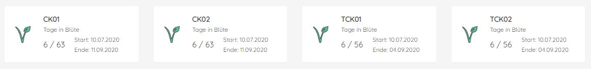

# mvc-grow-monitor
Grow Monitor &amp; Grow Control based on MVC ASP.Net 4.5 and CSharp
 
 
MVC WebTool used to control & monitor fans, a humdifier, watering, temperature and power plugs in a grow tent.
 
 

## Hardware required
- Windows Server with IIS 10
- MyStrom PowerPlugs (https://mystrom.ch/)
- Shelly H&amp;T Sensor (https://shelly.cloud/)
- For auto watering, we use a GARDENA-System (https://www.gardena.com/)
 
 

## What's working
Control the MyStrom plugs via the internal network (HTTP), temperature &amp; humidity values are collected via the Shelly Cloud API.
 
- Read correct values from: MyStrom Plug (EU), Shelly H&amp;T Sensor via Cloud
- Fully implemented SqLite Database
- DataCollector BackgroundTask to check device values every Minute
- Data History Option
- Treshold Values for Temperatur &amp; Humidity, sunset &amp; sunrise
- Mailalarm-Manager
 
 

## Improvements
- Create an API for Shelly which sends the values to this API with parameters according shelly-docu (temp=99&hum=48)
- Raspberry support with nginx: Port the whole solution to .NetCore 3.1
- CleanUp History after 7 days
- Electricity forecast and costs
- Update Bootstrap to latest version
- Implement jQueryUI
 
 

## Preview UI
Current UI development state, fully touch compatible in desktop and mobile responsive design:
 
 

 
 
Current work in progress (local branch) show plant details on button click:
 
 

 
 
Please note: We are still in a very early development phase. Please be careful with your power cabling and timer. We accept no liability for damage to materials or plants.
 
 

## Release Plan
Alpha Tests currently running on version 0.1.7502
 
Beta Tests planned for AUG-2020 (feel free to join our beta program)
 
 

## Be a part of it
Do you want to help? With pleasure! For more information visit our project homepage or write us a message.
 
 
