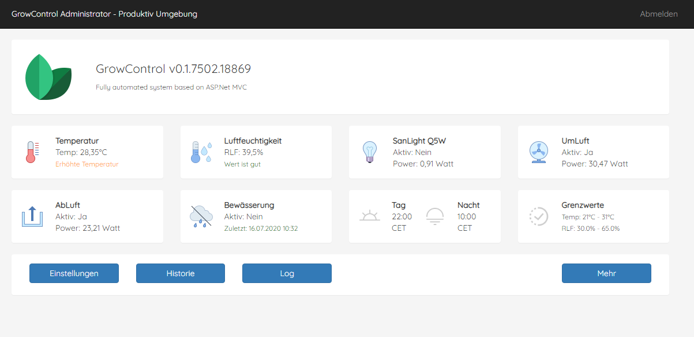

# mvc-grow-monitor
Grow Monitor &amp; Grow Control based on MVC ASP.Net 4.5
 
WebTool used to control & monitor fans, a humdifier, watering, temperature and power plugs in a grow tent

## Hardware required
- Windows Server with IIS 10 / RaspberryPi4 with nginx WebServer (planned for upcoming release)
- MyStrom PowerPlugs (https://mystrom.ch/)
- Shelly H&amp;T Sensor (https://shelly.cloud/)
- For auto watering, we use GARDENA (https://www.gardena.com/)

## Preview UI

## Logic
Control the MyStrom plugs via the internal network (HTTP), temperature &amp; humidity values are collected via the Shelly Cloud API (HTTPS + Auth. Token).
 
Improvement: Create an API for Shelly which sends the values to this API with parameters according shelly-docu (temp = 99 & hum = 48)
